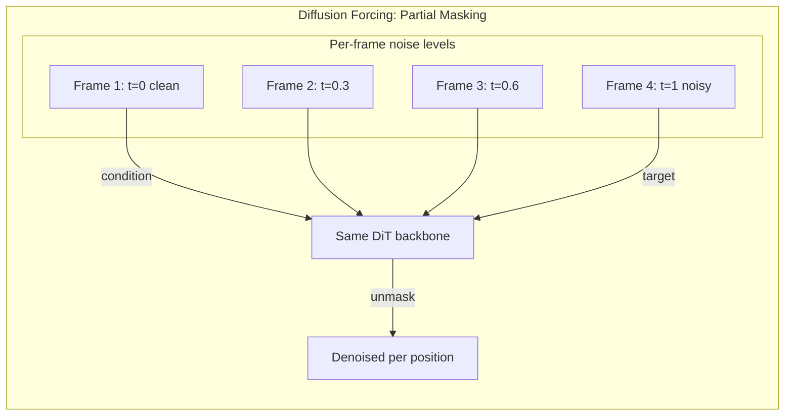
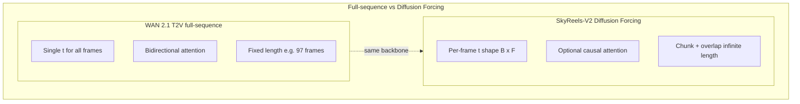
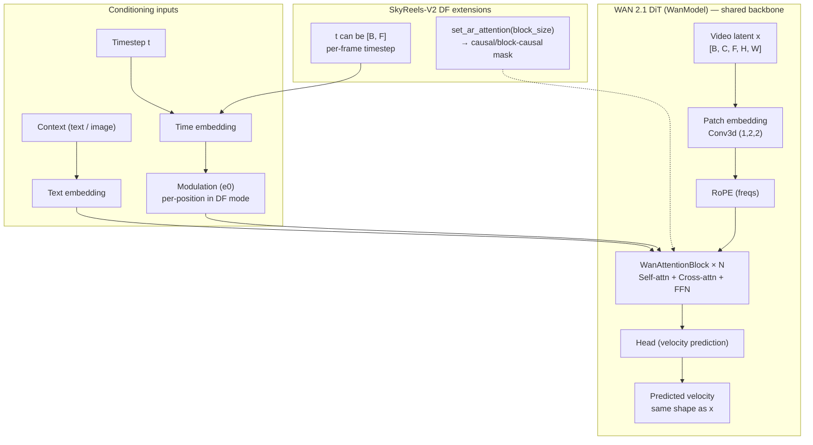
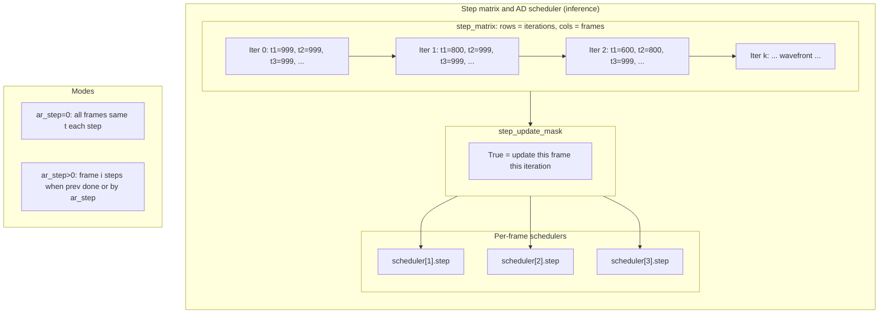
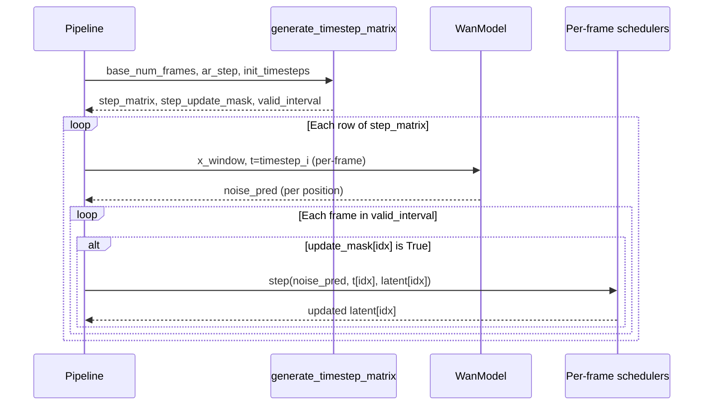
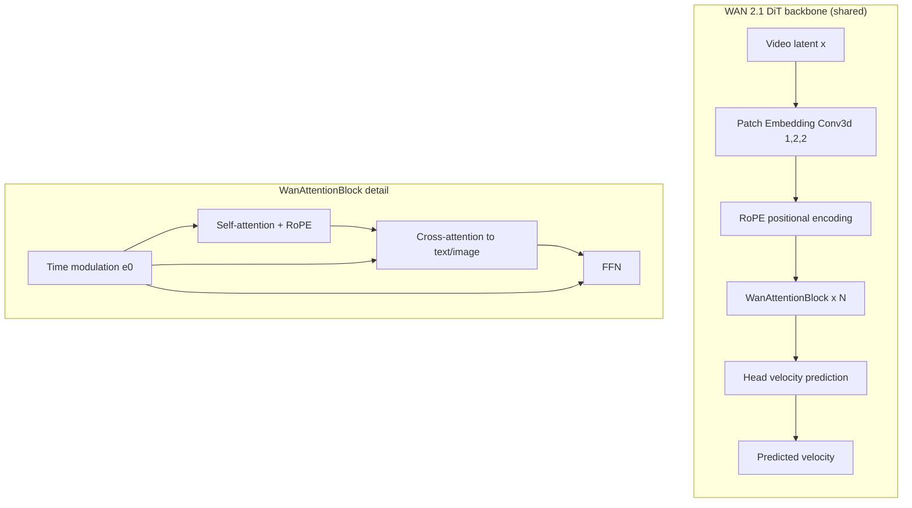
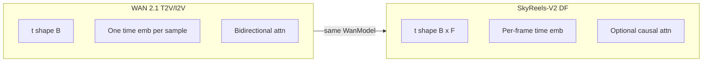
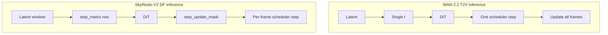
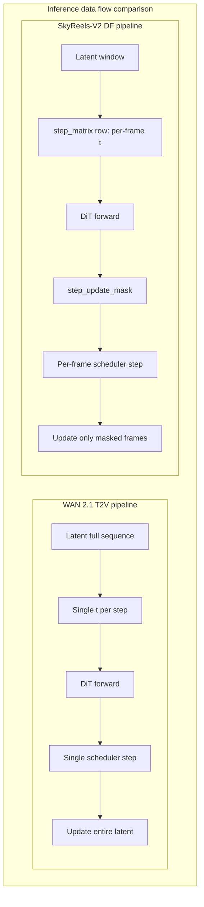
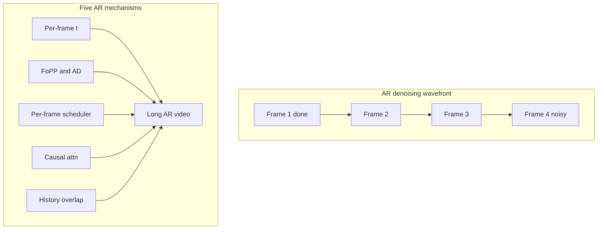

# SkyReels-V2 Diffusion Forcing Architecture

**Reference model:** WAN 2.1 – 1.3B parameter video diffusion transformer  
**Document scope:** How SkyReels-V2 extends the WAN 2.1 architecture to implement inference with **Diffusion Forcing** for autoregressive long-form video generation.

This document is based on:
- **Diffusion Forcing** (Chen et al., NeurIPS 2024) [arXiv:2407.01392](https://arxiv.org/abs/2407.01392)
- **AR-Diffusion** (non-decreasing timestep schedules) [11]
- **History-Guided Video Diffusion** (ICML 2025) [arXiv:2502.06764](https://arxiv.org/abs/2502.06764) — DFoT and history conditioning
- **SkyReels-V2 Technical Report** [arXiv:2504.13074](https://arxiv.org/pdf/2504.13074) and the SkyReels-V2 codebase

---

## 1. How the Diffusion Forcing Transformer Architecture Is Designed

### 1.1 Conceptual Foundation (Diffusion Forcing)

**Diffusion Forcing** treats each token (here, each frame or frame-block in latent space) as having an **independent noise level**. Denoising can then follow **per-token schedules**: some positions can be fully clean (unmasked), others noisy (masked), and the model learns to “unmask” any mix of noised tokens using cleaner tokens as context.

- **Zero noise** → token is fully observed (condition).
- **Full noise** → token is fully masked (to be generated).
- **Partial noise** → token is partially observed and guides recovery of noisier tokens.

So Diffusion Forcing is a form of **partial masking over the sequence**: the same backbone is trained to denoise under arbitrary per-position noise patterns, which at inference enables **autoregressive extension** by treating “past” frames as cleaner and “future” frames as noisier.





### 1.2 SkyReels-V2 Design: Same Backbone, New Conditioning and Schedules

SkyReels-V2 does **not** introduce a new transformer block layout. The **Diffusion Forcing Transformer** is the same **WAN 2.1 DiT (WanModel)** used for standard T2V/I2V, with two core extensions:

1. **Per-frame (per-token) timestep conditioning**
2. **Optional causal (or block-causal) self-attention** for AR inference

The rest (patch embedding, RoPE, cross-attention to text/image, flow matching objective) is shared with WAN 2.1.



#### 1.2.1 Per-frame timestep input

- **Standard WAN 2.1 (full-sequence diffusion):**  
  The model receives a single timestep `t` of shape `[B]`. Time embedding is computed once and broadcast to all spatial-temporal positions.

- **SkyReels-V2 Diffusion Forcing:**  
  The model can receive a **per-frame timestep** tensor `t` of shape `[B, F]` (F = number of latent frames in the current chunk).  
  Code (abridged) from `skyreels_v2_infer/modules/transformer.py`:

```python
# time embeddings
if t.dim() == 2:
    b, f = t.shape
    _flag_df = True   # Diffusion Forcing mode
else:
    _flag_df = False

e = self.time_embedding(
    sinusoidal_embedding_1d(self.freq_dim, t.flatten()).to(...)
)   # (B*F,) or (B,) -> (B*F, dim) or (B, dim)
e0 = self.time_projection(e).unflatten(1, (6, self.dim))   # (B, 6, dim) or (B*F, 6, dim)

if _flag_df:
    e = e.view(b, f, 1, 1, self.dim)
    e0 = e0.view(b, f, 1, 1, 6, self.dim)
    e = e.repeat(1, 1, grid_sizes[1], grid_sizes[2], 1).flatten(1, 3)
    e0 = e0.repeat(1, 1, grid_sizes[1], grid_sizes[2], 1, 1).flatten(1, 3)
    e0 = e0.transpose(1, 2).contiguous()   # per-position modulation
```

So in DF mode, **each (frame, height, width) position** gets its **own** time embedding derived from its frame’s timestep. That is exactly the “independent per-token noise level” of Diffusion Forcing: the backbone is unchanged; the **conditioning** is per-token.

#### 1.2.2 Optional causal self-attention

For autoregressive (and block-autoregressive) inference, the pipeline can switch the transformer to **causal** or **block-causal** self-attention:

- `transformer.set_ar_attention(causal_block_size)` sets `flag_causal_attention = True` and `num_frame_per_block`.
- When `flag_causal_attention` is True, a causal (or block-causal) mask is built so that position \(i\) only attends to positions \(\le i\) (or to the same and previous *blocks* of frames).
- This supports **history-conditioned generation**: “past” frames (already denoised) condition “future” frames (still noised), and allows K/V caching for past frames (e.g. TeaCache) to reduce compute.

So the **architecture** is still the same WanModel; the **attention pattern** is what changes for AR.

#### 1.2.3 Training: non-decreasing noise schedule (AR-Diffusion style)

From the SkyReels-V2 technical report (§3.4.2): training uses a **Frame-oriented Probability Propagation (FoPP)** timestep scheduler with a **non-decreasing constraint** along the frame axis (inspired by AR-Diffusion). That is, along the sequence, timesteps are constrained so that earlier frames are not “more noised” than later ones in a structured way, which:

- Shrinks the space of per-frame schedules from \(O(10^{48})\) to about \(O(10^{32})\).
- Stabilizes training and aligns with the causal “history conditions future” view.

Steps summarized from the report:

1. Sample a frame index \(f\) and timestep \(t\).
2. Use dynamic programming to assign timesteps to other frames under the **non-decreasing** constraint.
3. Define transition counts \(d^s_{i,j}\), \(d^e_{i,j}\) and visit probabilities for frames before/after \(f\).
4. Sample full per-frame timesteps from these probabilities.

The same WanModel is thus fine-tuned with this **per-frame** noise schedule so it can later be driven by the inference-time AD scheduler (below).

#### 1.2.4 Inference: Adaptive Difference (AD) scheduler and step matrix

At inference, the pipeline does **not** use a single global timestep. It builds a **step matrix** where each **row** is one “iteration” and each **column** is a frame; the entry at \((i, j)\) is the timestep for frame \(j\) at iteration \(i\). Frames can progress along the diffusion schedule at different rates:

- **Synchronous mode** (`ar_step=0`): all frames share the same timestep at each step (same as full-sequence diffusion).
- **Asynchronous mode** (`ar_step>0`): frames are denoised with a fixed “step difference” between neighboring frames (AD scheduler), so earlier frames become clean first and act as context for later ones.

The core logic lives in `DiffusionForcingPipeline.generate_timestep_matrix()`:

- It advances a “front” of denoising along the sequence: e.g. first frame advances by 1 step; next frame advances when the previous is “done” or by an offset `ar_step`.
- Outputs: `step_matrix` (per-frame timesteps per iteration), `step_update_mask` (which frames to update at each iteration), and `valid_interval` (which slice of frames is in the current window for long-video chunks).

So the **Diffusion Forcing Transformer** is the same WAN 2.1 DiT, fed with this **per-frame** `t` and optional causal attention; the **pipeline** implements Diffusion Forcing by how it constructs and applies these timesteps and masks.





#### 1.2.5 History conditioning (History-Guided style)

SkyReels-V2 uses **history as condition** in two ways, consistent with “history-guided” Diffusion Forcing:

1. **Prefix / overlap:** For long video, each new segment starts from the **last frames of the previous segment** (e.g. `overlap_history=17`). Those prefix frames are encoded to latent and written into the beginning of the current latent chunk; they are given **clean or lightly noised** timesteps so they act as fixed context.
2. **Add-noise condition:** Optionally, a small amount of noise is added to the prefix latents (`addnoise_condition`), and their timestep is set to a non-zero value. This avoids a hard discrete jump from “fully clean” to “noisy” and can improve consistency at segment boundaries.

So the **design** of the Diffusion Forcing Transformer in SkyReels-V2 is: **same WAN 2.1 backbone + per-frame timestep conditioning + optional causal attention + FoPP/AD and history-conditioning in training and inference**. See diagram in Section 2 for long-video chunk flow.

---

## 2. Comparison to the WAN 2.1 1.3B Diffusion Transformer Architecture





### 2.1 What Stays the Same (Shared WAN 2.1 Core)

- **Backbone:** Same `WanModel` (DiT): patch embedding, RoPE, `WanAttentionBlock` (self-attn + cross-attn + FFN), modulation by time (and optionally FPS), and head.
- **VAE:** Same Wan2.1 VAE (`Wan2.1_VAE.pth`); same latent layout (e.g. 16 channels, temporal stride 4, spatial 8).
- **Text (and image) conditioning:** Same text encoder and cross-attention (T2V / I2V); same text embedding and optional CLIP image context for I2V.
- **Flow matching:** Same velocity-prediction formulation and FlowUniPCMultistepScheduler; same training objective (velocity loss) and logit-normal timestep sampling.
- **Resolution and patch size:** Same patch size `(1,2,2)` and resolution support (e.g. 540P/720P, 97/121 frames).

So the **1.3B (and 14B) Diffusion Forcing checkpoints** are the same **architecture** as the WAN 2.1 1.3B T2V/I2V DiT; they are the same transformer with different **training** (full-sequence vs Diffusion Forcing with non-decreasing schedule) and **inference** usage (single `t` vs per-frame `t` and optional causal attention).

### 2.2 What Differs: Conditioning and Usage

| Aspect | WAN 2.1 1.3B (T2V / I2V) | SkyReels-V2 DF (1.3B / 14B) |
|--------|---------------------------|-----------------------------|
| **Timestep shape** | `t`: `[B]` (one per batch) | `t`: `[B, F]` (one per frame in chunk) |
| **Time embedding** | One embedding per sample, broadcast to all positions | Per-frame embedding, expanded to (F, H, W) and used for per-position modulation |
| **Self-attention** | Bidirectional (full attention over all frames) | Can be set to causal or block-causal via `set_ar_attention(causal_block_size)` |
| **Scheduler at inference** | One global scheduler; one `t` per step; one update for whole sequence | Many per-frame schedulers; `step_matrix` gives per-frame `t` per iteration; `step_update_mask` selects which frames to update each time |
| **Sequence length** | Fixed (e.g. 97 or 121 frames) | Fixed per *chunk*, but chunks can be concatenated with overlap for unbounded length |
| **History** | Not used (single-shot generation) | Prefix/overlap + optional `addnoise_condition` for segment-to-segment continuity |




So the **only** architectural difference inside the transformer is the **support for 2D `t` and the optional causal mask**; everything else is interface and pipeline.



---

## 3. Key Differences That Enable Autoregressive Frame Generation

These are the concrete mechanisms that allow “autoregressive” (and long-form) behavior.



### 3.1 Per-frame timesteps and “partial masking”

- **Mechanism:** Each frame has its own diffusion timestep. So in one forward pass you can have: frame 1 at \(t=0\) (clean), frame 2 at \(t=0.2\), …, frame 25 at \(t=1\) (noisy). The model is trained (via FoPP) to denoise under such patterns.
- **Role:** Cleaner frames act as **observed context**; noisier frames are **targets**. So “past” (already denoised) and “future” (still noised) are distinguished by noise level, not by a different model. This is the core of Diffusion Forcing.
- **Where in code:** `transformer.py` lines 571–699: `t.dim() == 2` branch and the reshaping of `e`/`e0` to per-position; pipeline passes `timestep = timestep_i[None, valid_interval_start:valid_interval_end].clone()` (per-frame) into the transformer.

### 3.2 Non-decreasing schedule (training) and AD scheduler (inference)

- **Training:** Non-decreasing timesteps along frames (FoPP) reduce the schedule space and stabilize training.
- **Inference:** The AD (Adaptive Difference) rule:
  - If the previous frame is “done” (timestep 0) or this is the first frame: current frame steps by 1.
  - Else: current frame’s timestep is `min(prev_timestep + ar_step, T)`.
- **Role:** This gives a **wavefront** of denoising: frame 1 clears first, then frame 2, etc. So generation is **autoregressive in the diffusion sense**: earlier frames are fixed (or nearly fixed) and condition later ones. `ar_step=0` recovers synchronous full-sequence diffusion; `ar_step>0` is the autoregressive regime.
- **Where in code:** `generate_timestep_matrix()` in `diffusion_forcing_pipeline.py` (e.g. lines 109–185) implements the iteration/row updates and builds `step_matrix`, `step_update_mask`, and `valid_interval`.

### 3.3 Per-frame scheduler steps and update mask

- **Mechanism:** The pipeline keeps one `FlowUniPCMultistepScheduler` per frame (or per causal block). For each row of `step_matrix`, it runs the transformer once on the current window, then for each frame index only if `step_update_mask[i, idx]` is True does it call `sample_schedulers[idx].step(...)` for that frame.
- **Role:** So each frame moves along its **own** diffusion trajectory, but all frames in the window are processed in one transformer forward. This is how “per-token schedules” are realized at inference without changing the model.
- **Where in code:** `diffusion_forcing_pipeline.py` loops over `step_matrix` (e.g. lines 352–358, 470–476, 631–637): one forward per row, then per-frame `scheduler.step` only where `update_mask_i[idx]` is True.

### 3.4 Causal (or block-causal) attention

- **Mechanism:** `set_ar_attention(causal_block_size)` builds a mask so that each position only attends to itself and previous positions (or previous blocks of frames if `causal_block_size>1`), and uses it in self-attention (e.g. SDPA with `attn_mask=block_mask` or a hand-built causal mask).
- **Role:** Ensures information flows only from “past” to “future,” so the model cannot use future frames to refine past ones. This matches the autoregressive interpretation and enables K/V caching (e.g. TeaCache) for past frames.
- **Where in code:** `transformer.py`: `_prepare_blockwise_causal_attn_mask`, `set_ar_attention`, and in `WanSelfAttention.forward` the branch that uses `block_mask` for SDPA when `_flag_ar_attention` is True.

### 3.5 History as prefix and overlap

- **Mechanism:** For long video, the next chunk’s latent is initialized with noise except for the first `overlap_history` latent frames, which are filled with the **encoded last frames** of the previous decoded segment. Those prefix frames get timestep 0 (or a small `addnoise_condition` value) so they are treated as fixed condition.
- **Role:** The model extends the **existing** video instead of generating from scratch each time; this is “history-guided” extension and avoids discontinuity at chunk boundaries.
- **Where in code:** In `extend_video` and in the long-video branch of `__call__`: `prefix_video = output_video[:, -overlap_history:]`, encode with VAE, then `latents[0][:, :predix_video_latent_length] = prefix_video[0]`; and the step matrix / update logic accounts for `num_pre_ready` so those prefix positions are not updated.

---

## Summary

- **Architecture:** The SkyReels-V2 Diffusion Forcing model **is** the WAN 2.1 1.3B (or 14B) DiT, with added support for **per-frame timestep** `t` and **optional causal/block-causal self-attention**. No new block types or new layers.
- **Training:** Same flow-matching loss; difference is **per-frame** noise levels with a **non-decreasing** (FoPP) schedule so the model learns to denoise under Diffusion Forcing schedules.
- **Inference:** The **pipeline** implements Diffusion Forcing by (1) building a per-frame **step matrix** and **update mask**, (2) passing **per-frame `t`** into the transformer, (3) applying **per-frame** scheduler steps, and (4) optionally using **causal attention** and **history prefix/overlap** for long, autoregressive video.

So the “Diffusion Forcing Transformer” in SkyReels-V2 is the WAN 2.1 diffusion transformer **used in a Diffusion Forcing regime** (per-token noise levels, non-decreasing schedule, AD scheduler, history conditioning, optional causality), not a different core architecture.

---

## References

- **Diffusion Forcing:** Chen et al., “Diffusion Forcing: Next-token Prediction Meets Full-Sequence Diffusion,” NeurIPS 2024. [arXiv:2407.01392](https://arxiv.org/abs/2407.01392)
- **AR-Diffusion:** Non-decreasing timestep schedules and FoPP/AD scheduler (cited as [11] in SkyReels-V2 report).
- **History-Guided Video Diffusion:** Song et al., “History-Guided Video Diffusion,” ICML 2025. [arXiv:2502.06764](https://arxiv.org/abs/2502.06764) — DFoT and variable-length history conditioning.
- **SkyReels-V2 Technical Report:** SkyReels Team, “SkyReels-V2: Infinite-Length Film Generative Model,” 2025. [arXiv:2504.13074](https://arxiv.org/pdf/2504.13074)
- **WAN 2.1:** Alibaba Wan Team, video diffusion DiT and VAE (Hugging Face / ModelScope: e.g. Skywork/SkyReels-V2-DF-1.3B-540P, Skywork/SkyReels-V2-I2V-1.3B-540P).
